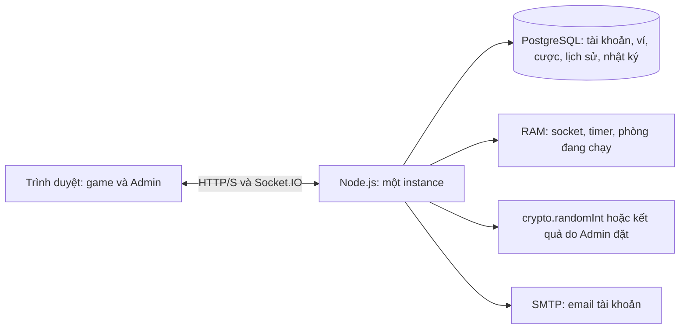

# Bầu Cua Victory

Game bầu cua nhiều người chơi trên trình duyệt, dùng được trên điện thoại và máy tính. Mỗi phòng có tối đa **20 người**; server tự mở cược, lắc xúc xắc, thanh toán và chuyển sang ván tiếp theo. Dự án sử dụng **xu ảo**, không có chức năng nạp, rút hoặc đổi tiền.

Dự án gồm giao diện game, Admin web, backend HTTP/Socket.IO và PostgreSQL. Docker Compose hiện dùng để chạy **database**; frontend và backend chạy bằng Node.js trên máy.

## Tính năng hiện tại

### Sảnh và tài khoản

- **Chơi nhanh:** tạo phòng mới và vào chơi ngay sau khi đăng nhập.
- **Chơi với bạn:** tạo phòng, tham gia bằng mã phòng hoặc chia sẻ link mời.
- **Đăng ký, đăng nhập, đăng xuất:** tài khoản lưu trong PostgreSQL; tài khoản mới nhận 100.000 xu khởi tạo một lần.
- **Hồ sơ & ví:** cập nhật tên hiển thị, chọn avatar có sẵn, xem số dư, giao dịch và lịch sử ván, đổi mật khẩu, đăng xuất mọi thiết bị.
- **Email:** xác minh email và khôi phục mật khẩu qua email đã xác minh; cần cấu hình SMTP để gửi thư.
- Sảnh có tài nguyên chuyển động WebP và video nhẹ cho thẻ Chơi với bạn trên điện thoại.

### Trong game

- Phòng tối đa 20 người tính cả host; các phòng có ván chơi độc lập.
- Mặc định **30 giây đặt cược**, tiếp theo là hiệu ứng mở kết quả; sau **5 giây xem kết quả** sẽ tự mở ván mới.
- Chọn chip hoặc **All-in**, rồi bấm một trong sáu biểu tượng để đặt cược. Server kiểm tra số dư, quyền chơi và trạng thái ván trước khi nhận cược.
- Người vào phòng trong giai đoạn mở cược có thể cược ngay; vào khi đã khóa cược thì chờ ván tiếp theo.
- Hiển thị kết quả ba xúc xắc, số xu, bảng xếp hạng, lịch sử và thống kê; có chat phòng, emoji, vật phẩm tương tác, âm thanh và chế độ toàn màn hình.
- Host có thể kick thành viên. Quyền host phòng và quyền Admin hệ thống là hai vai trò riêng.
- Kết nối mới của cùng tài khoản tiếp quản quyền chơi; số dư được dùng chung giữa các thiết bị. Cược đã được server nhận vẫn được xử lý khi người chơi mất mạng hoặc đăng xuất.

**Cách tính thưởng:** cược bị trừ khi được chấp nhận. Nếu biểu tượng xuất hiện `k > 0` lần, số xu nhận là `tiền cược × (k + 1)`, bao gồm tiền gốc; không xuất hiện thì nhận 0. Ví dụ cược 50 xu vào Cua: xuất hiện 0/1/2/3 lần thì nhận lần lượt 0/100/150/200 xu.

### Admin web

Trang `/admin` yêu cầu tài khoản Admin và xác minh **MFA bằng Authenticator**. Các thao tác thay đổi dữ liệu có kiểm tra quyền, CSRF và ghi nhật ký.

| Mục | Chức năng |
|---|---|
| Tổng quan | Xem số liệu tài khoản, ví, phòng và trạng thái đang chạy. |
| Người chơi | Tra cứu tài khoản, cấp xu, khóa/mở khóa và xóa mềm người chơi. |
| Phòng chơi | Xem phòng, điều chỉnh thời gian cược, khóa tham gia, tạm dừng/tiếp tục và hủy phòng. |
| Kết quả ván | Chọn kết quả ba xúc xắc hoặc trả về chế độ ngẫu nhiên trong phạm vi ván cho phép. |
| Nhật ký | Tra cứu các thao tác quản trị và lý do thực hiện. |
| Dọn dữ liệu | Xem trước và xóa vĩnh viễn dữ liệu cũ theo thời hạn giữ. |

**Dọn dữ liệu** cho phép giữ từ 1 đến 3650 ngày gần nhất, mặc định 30 ngày. Có thể chọn phòng đã đóng, người chơi đã xóa mềm và nhật ký cũ. Mỗi lượt tối đa 200 đối tượng của từng nhóm; phải xem trước, nhập `XOA VINH VIEN` và xác nhận lý do trước khi xóa. Tài khoản Admin, dữ liệu đang hoạt động và nhật ký dọn dữ liệu được giữ. Khi dọn phòng, ví/sổ giao dịch của người chơi còn được giữ không bị xóa, nhưng lịch sử chi tiết thuộc phòng đã dọn sẽ mất.

Xem [quy tắc và hướng dẫn dọn dữ liệu](docs/ADMIN_DATABASE_CLEANUP.md). PostgreSQL có thể tái sử dụng vùng trống sau khi xóa; dung lượng file trên đĩa không nhất thiết giảm ngay.

## Công nghệ và kiến trúc

| Thành phần | Công nghệ và vai trò |
|---|---|
| Frontend | HTML, CSS, JavaScript ES modules; Vite 8 để phát triển và build game/Admin. |
| Backend | Node.js 24, HTTP server và Socket.IO 4 để xử lý API, phòng và sự kiện thời gian thực. |
| Database | PostgreSQL; thư viện `pg`, repository/service, SQL migration và transaction. |
| Mật khẩu/phiên | Argon2; cookie phiên HttpOnly, token được lưu dạng băm trong database. |
| MFA | Mã TOTP từ Authenticator; khóa `MFA_ENCRYPTION_KEY` bảo vệ dữ liệu MFA lưu trong database. |
| Email | Nodemailer và SMTP cho xác minh email/khôi phục mật khẩu. |
| Kiểm thử | `node:test`, Socket.IO client và database test riêng. |
| Đóng gói | Docker Compose cho PostgreSQL 18.6; Dockerfile cho ứng dụng; cấu hình Render trong `render.yaml`. |



Server quyết định cược, kết quả và số dư; frontend nhận trạng thái chính thức theo từng người chơi. Giao dịch ví dùng transaction và khóa bản ghi để tránh cập nhật số dư đồng thời. `requestId` giúp chống xử lý lặp; `roundId` chặn lệnh từ ván cũ. Socket.IO kiểm tra lại phiên tài khoản khi xử lý lệnh.

Tài khoản, ví và lịch sử lưu lâu dài trong PostgreSQL. Khi backend khởi động lại, cơ chế phục hồi đối soát ván chưa chốt, xử lý hoàn cược/thanh toán và đóng phòng cũ; không khôi phục nguyên timer/phòng đang chơi.

## Cài đặt trên máy mới

Các lệnh dưới đây dùng **PowerShell trên Windows**, chạy tại thư mục chứa `package.json` và `compose.yaml`.

### 1. Chuẩn bị môi trường

- **Node.js 24.x** và npm, đúng với yêu cầu trong `package.json`.
- **Docker Desktop** đã mở và engine đang chạy; có lệnh `docker compose`.
- Nhận source code từ repository của nhóm. Clone source không sao chép database, tài khoản hoặc `.env` của máy khác.

```powershell
node --version
npm.cmd --version
docker compose version
```

### 2. Cấu hình `.env`

Tạo file từ mẫu nếu chưa có, rồi mở để chỉnh:

```powershell
if (-not (Test-Path .\.env)) {
    Copy-Item .\.env.example .\.env
}
notepad .\.env
```

Với **database Docker mới**, sửa các biến dưới đây. Thay toàn bộ giá trị `THAY_...`; chỉ giữ một dòng đang hoạt động cho mỗi biến.

```env
DB_HOST=127.0.0.1
DB_PORT=5433
DB_USER=postgres
DB_PASSWORD=THAY_BANG_MAT_KHAU_DATABASE
DB_NAME_DEV=bau_cua_dev
DB_NAME_TEST=bau_cua_test
DOCKER_DB_PASSWORD=THAY_BANG_MAT_KHAU_DATABASE
PORT=3000
MFA_ENCRYPTION_KEY=THAY_BANG_KHOA_MFA_DA_SINH
```

`DB_PASSWORD` và `DOCKER_DB_PASSWORD` phải giống nhau. Sinh khóa MFA một lần cho database mới và dán kết quả vào biến tương ứng:

```powershell
node -e "console.log(require('node:crypto').randomBytes(32).toString('base64url'))"
```

Giữ khóa MFA ổn định giữa các lần chạy. Nếu dùng database đã có cấu hình MFA, sử dụng khóa gốc tương ứng thay vì sinh lại. Mật khẩu database và mật khẩu đăng nhập Admin là hai thông tin khác nhau.

`DATABASE_URL`/`TEST_DATABASE_URL` được ưu tiên hơn `DB_*`; kiểm tra các URL cũ trong `.env` và `.env.test` nếu chuyển sang Docker. Với PostgreSQL cài trực tiếp trên Windows, dùng cổng phù hợp (thường 5432), tự tạo hai database và bỏ bước khởi động Compose.

Giữ chế độ PostgreSQL mặc định để dùng tài khoản và Admin. `PERSISTENCE_ENABLED=false` chọn server RAM cũ, không có API xác thực/Admin.

### 3. Khởi động database và chạy dự án

Chạy lần lượt, xử lý lỗi của từng lệnh trước khi tiếp tục:

```powershell
docker compose up -d --wait
docker compose ps
npm.cmd ci
npm.cmd run db:migrate
npm.cmd run dev
```

- **Game:** http://localhost:5173/
- **Admin:** http://localhost:5173/admin
- **Backend/health:** http://localhost:3000/api/health

`npm run dev` chạy cả backend và Vite; giữ terminal mở. Vite chuyển `/api` và `/socket.io` tới backend cổng 3000. Mỗi cổng chỉ chạy một tiến trình tương ứng.

Compose ánh xạ `127.0.0.1:5433` trên máy tới cổng 5432 trong container. Lần đầu khởi tạo volume trống, database `bau_cua_dev` và `bau_cua_test` được tạo. Migration hiện có các phiên bản **001–008**; chạy lại `db:migrate` khi cập nhật source để áp dụng migration còn thiếu.

Dữ liệu database lưu trong named volume. `docker compose down` giữ volume; **`docker compose down -v` xóa dữ liệu trong volume**. Thay `DOCKER_DB_PASSWORD` trong `.env` không tự đổi mật khẩu PostgreSQL của volume đã tồn tại.

### 4. Tạo và đăng nhập Admin

Trên database mới, mở terminal khác tại thư mục dự án và tạo Admin đầu tiên. Username/email phải chưa được sử dụng; mật khẩu có ít nhất 12 ký tự.

```powershell
$adminUsername = Read-Host 'Ten dang nhap Admin'
$adminEmail = Read-Host 'Email Admin'
$adminDisplayName = Read-Host 'Ten hien thi'
$adminPassword = Read-Host 'Mat khau (it nhat 12 ky tu)' -AsSecureString
$env:ADMIN_BOOTSTRAP_PASSWORD = [System.Net.NetworkCredential]::new('', $adminPassword).Password
try {
    npm.cmd run admin:create -- $adminUsername $adminEmail $adminDisplayName
    if ($LASTEXITCODE -ne 0) { throw 'Tao Admin that bai; xem loi o tren.' }
} finally {
    Remove-Item Env:ADMIN_BOOTSTRAP_PASSWORD -ErrorAction SilentlyContinue
    Remove-Variable adminPassword -ErrorAction SilentlyContinue
}
```

Mở `/admin`, đăng nhập tài khoản vừa tạo, thiết lập Authenticator theo hướng dẫn trên web và nhập mã xác minh. Tài khoản đăng ký từ game có vai trò `player`; tạo phòng không cấp quyền Admin.

Nếu đã có Admin, đăng nhập bằng tài khoản hiện có. Script sẽ chặn tạo thêm theo mặc định; cách tạo Admin bổ sung, thiết lập MFA, truy cập trong LAN và xử lý lỗi nằm trong [hướng dẫn cài đặt và đăng nhập Admin](docs/HUONG_DAN_CAI_DAT_VA_DANG_NHAP_ADMIN.md).

### 5. Chạy bản đã build

Dừng chế độ phát triển bằng `Ctrl+C`, sau đó:

```powershell
npm.cmd start
```

`npm start` tự chạy `npm run build` qua `prestart`, rồi phục vụ game, Admin, HTTP API và Socket.IO từ một backend:

- Game: http://localhost:3000/
- Admin: http://localhost:3000/admin

## Các lệnh thường dùng

| Lệnh | Mục đích |
|---|---|
| `npm ci` | Cài thư viện đúng theo `package-lock.json`. |
| `npm run dev` | Chạy backend và Vite trong chế độ phát triển. |
| `npm run db:migrate` | Áp dụng migration cho database được cấu hình. |
| `npm run build` | Build giao diện game và Admin vào `dist/`. |
| `npm start` | Build và chạy ứng dụng phục vụ giao diện đã build. |
| `npm run test:core` | Kiểm thử client, luật game và Socket.IO. |
| `npm run test:db` | Tự migrate DB test, rồi kiểm thử database/repository/service/API. |
| `npm test` | Chạy cả `test:core` và `test:db`. |
| `npm run admin:create -- <username> <email> <ten-hien-thi>` | Tạo Admin; cần biến môi trường tạm `ADMIN_BOOTSTRAP_PASSWORD`. |
| `npm run admin:mfa-reset -- <username>` | Đặt lại MFA qua công cụ vận hành; xem hướng dẫn Admin trước khi dùng. |

Trên PowerShell, dùng `npm.cmd` nếu `npm.ps1` bị chặn. `npm run preview` chỉ xem bản frontend đã build; để kiểm tra đầy đủ API/game, dùng `npm start`.

## Kiểm thử

```powershell
npm.cmd test
npm.cmd run build
```

DB test mặc định là `bau_cua_test`. Runner đọc `.env` và `.env.test` nếu có, tự áp dụng migration và từ chối tên database không có dấu hiệu `test`. Dùng database test riêng vì bộ kiểm thử tạo và xóa dữ liệu thử nghiệm.

Lần kiểm tra gần nhất ngày **01/10/2026**: **127 kiểm thử đạt** (63 core, 64 database); build game/Admin thành công. Các bộ kiểm thử bao phủ luật thưởng, 20 kết nối/giới hạn người thứ 21, lặp lệnh, cược không hợp lệ, quyền truy cập, ví/giao dịch, MFA, quản trị và điều kiện dọn dữ liệu/rollback. Luồng dọn dữ liệu cũng đã được kiểm tra bằng trình duyệt trên database test.

Các mốc kiểm tra trước được lưu trong [TEST_RESULTS.md](docs/TEST_RESULTS.md). Kiểm thử kết nối cục bộ chưa thay thế kiểm tra hiệu năng trên hosting và thiết bị thật.

## Cấu trúc thư mục

```text
.
├── src/
│   ├── main.js                 # Frontend game
│   ├── features/
│   │   ├── hub/                # Sảnh và hiệu ứng thẻ
│   │   ├── auth/               # Đăng ký, đăng nhập
│   │   ├── account/            # Hồ sơ, ví, lịch sử tài khoản
│   │   ├── game/               # Giao diện bàn, bát và lịch sử ván
│   │   └── admin/              # Admin web và hộp thoại xác nhận
│   └── styles/                 # CSS dùng chung
├── server/
│   ├── index.js                # Điểm khởi động backend
│   ├── db/                     # Kết nối, transaction và audit
│   ├── repositories/           # Truy vấn và lưu dữ liệu
│   └── services/               # Auth, MFA, ví, game, Admin, dọn dữ liệu
├── config/                     # Cấu hình trò chơi
├── migrations/                 # SQL migration có phiên bản
├── docker/postgres/            # Script tạo database test khi khởi tạo volume
├── scripts/                    # Dev, migration, công cụ Admin và dựng media
├── tests/                      # Client, server, DB, repository, service và browser
├── public/                     # Tài nguyên phục vụ game và sảnh
├── docs/                       # Hướng dẫn, tài liệu và archive
├── index.html                  # Trang game
├── admin.html                  # Trang Admin
├── compose.yaml                # PostgreSQL Docker
├── Dockerfile                  # Đóng gói ứng dụng
├── render.yaml                 # Cấu hình triển khai Render
└── .env.example                # Mẫu cấu hình, không chứa bí mật thật
```

Video nguồn cục bộ trong `media-sources/hub/` được bỏ qua bởi Git/Docker. Source clone đã có tài nguyên WebP/MP4 trong `public/`, nên chạy/build thông thường không cần video nguồn hoặc FFmpeg. Xem [cấu trúc chi tiết](docs/PROJECT_STRUCTURE.md) và [nguồn tài nguyên](docs/ASSET_CREDITS.md).

## Triển khai

`Dockerfile` đóng gói frontend đã build và backend Node; `render.yaml` là cấu hình cho dịch vụ web. Các file này không tự tạo database hoặc cung cấp thông tin kết nối/MFA.

Khi triển khai cần cấu hình database PostgreSQL, `DATABASE_URL` (hoặc `DB_*`), khóa MFA ổn định, origin/domain phù hợp và chạy migration. Bản production cần HTTPS để sử dụng cookie phiên Secure. Dockerfile dùng `NODE_ENV=production`; SMTP và `PUBLIC_APP_URL` cần cấu hình nếu sử dụng email.

Hiện kiến trúc chạy **một instance backend** vì socket, timer và phòng đang chạy nằm trong RAM. Chưa có cơ chế đồng bộ phòng giữa nhiều instance. Xem [tài liệu Render](docs/DEPLOY_RENDER.md) cùng yêu cầu database/MFA ở README này khi triển khai.

## Phạm vi đang phát triển

- Thẻ chọn bàn công khai, game khác, thêm bàn và giải đấu còn là giao diện chờ phát triển; Chơi nhanh hiện tạo phòng mới.
- Quà/quảng cáo thưởng chưa tích hợp luồng cấp xu thật; phần mô phỏng ở môi trường phát triển không phải giao dịch ví trên server.
- Chat trong sảnh là tương tác cục bộ; chat trong phòng dùng Socket.IO.
- Email cần SMTP thật. Giao diện không thể tự gửi thư khi thiếu cấu hình.
- Server dùng `crypto.randomInt` khi không có kết quả do Admin đặt. Dự án có chức năng điều chỉnh kết quả cho quản trị, chưa có cơ chế chứng minh công bằng mật mã.

## Tài liệu cho nhóm

- [Cài đặt và đăng nhập Admin trên Windows](docs/HUONG_DAN_CAI_DAT_VA_DANG_NHAP_ADMIN.md).
- [PostgreSQL trong Docker, chuyển dữ liệu và vận hành](docs/POSTGRES_DOCKER.md).
- [Dọn dữ liệu cũ trong Admin](docs/ADMIN_DATABASE_CLEANUP.md).
- [Bàn tự động và quyền host](docs/AUTOMATIC_ROOMS.md).
- [Hợp đồng tích hợp database](docs/DATABASE_INTEGRATION_CONTRACT.md).
- [Tổng hợp chức năng và sơ đồ](docs/TONG_HOP_CHUC_NANG_VA_SO_DO.md).

Khi đưa source lên Git, giữ `package-lock.json`, `.env.example`, `compose.yaml`, script trong `docker/postgres/`, migration và tài nguyên trong `public/` để thành viên khác cài lại được. `.gitignore` đã loại `.env`, `.env.test`, `node_modules/`, `dist/`, `.tools/` và video nguồn cục bộ. Mật khẩu, khóa MFA và bản sao lưu database cần được giữ riêng ngoài repository.
