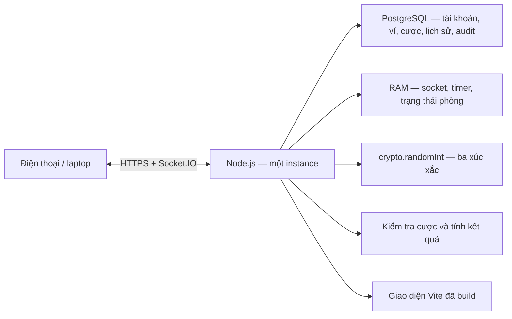

# Bầu Cua Arena

Game bầu cua chơi chung phòng trên điện thoại và laptop, tối đa **20 người/phòng**. Server tự mở cược 30 giây, lắc và tính xu riêng cho từng người; sau 5 giây xem kết quả sẽ mở ván mới. Chỉ sử dụng xu ảo, không nạp/rút hay đổi tiền. Xem [bàn tự động và quyền host](docs/AUTOMATIC_ROOMS.md).
- Còn cần triển khai Internet trên Render mọi người ai biết làm hosting hoặc đã từng deploy web rồi nhắn nhóm zalo nhận việc mình làm được mà lấy kinh nghiệm.

## Chạy trên máy

Yêu cầu Node.js 24.x, npm và PostgreSQL (máy development hiện dùng PostgreSQL 18).
Tạo `bau_cua_dev`, `bau_cua_test` và cấu hình `.env` theo `.env.example` nếu chạy trên máy mới. Không ghi mật khẩu hay khóa MFA vào Git.

Có thể chạy PostgreSQL 18.6 bằng Docker Compose trên cổng 5433; xem [hướng dẫn database Docker](docs/POSTGRES_DOCKER.md). Frontend và backend vẫn chạy bằng Node.js trên máy.

Thành viên nhóm cài máy mới hoặc đăng nhập trang quản trị: [hướng dẫn cài đặt và đăng nhập Admin web](docs/HUONG_DAN_CAI_DAT_VA_DANG_NHAP_ADMIN.md).

```sh
npm ci
npm run db:migrate
npm run build
npm start
```

Mở **http://localhost:3000**. Một tiến trình phục vụ cả giao diện đã build, HTTP API và Socket.IO. Giữ tiến trình chạy khi sử dụng; sau khi khởi động lại máy cần chạy lại `npm start`.

Khi phát triển, dùng một terminal (lệnh này chạy cả backend và Vite):

```sh
npm run dev
```

Mở **http://localhost:5173**. Vite chuyển `/api` và `/socket.io` tới Node cổng 3000. Không chạy thêm một Node server khác nếu cổng 3000 đã được sử dụng. Trên PowerShell nếu `npm.ps1` bị chặn, dùng `npm.cmd` thay cho `npm`.

## Cách chơi cùng bạn bè

1. Đăng ký/đăng nhập rồi tạo phòng. Người tạo là host phòng, không trở thành Admin hệ thống.
2. Gửi link mời hoặc mã phòng cho bạn bè. Mỗi tài khoản có một ví chung và một quyền chơi chủ động, tối đa 20 ghế/phòng.
3. Ván mở ngay khi tạo phòng. Chọn chip, số xu tùy chọn hoặc All-in rồi bấm biểu tượng; server xác nhận cược.
4. Hết 30 giây, server khóa cược và tự lắc. Sau hiệu ứng ngắn, cả phòng xem cùng ba biểu tượng.
5. Theo dõi số xu, bảng xếp hạng và lịch sử; ván tiếp theo tự mở sau 5 giây.

Ví dụ cược 50 xu vào Cua: xuất hiện 0 lần → nhận 0; 1 lần → nhận 100; 2 lần → nhận 150; 3 lần → nhận 200. Số nhận đã bao gồm hoàn cược. Lãi/lỗ = tổng nhận − tổng cược.

Cược được trừ ví và ghi sổ trong cùng transaction khi server chấp nhận; xóa/hủy hợp lệ được hoàn, trả thưởng bao gồm cả gốc. Host chỉ quản lý thành viên bằng kick; các lệnh cấp xu, khóa/tạm dừng/hủy phòng, thời gian và kết quả nằm trong `/admin`, bắt buộc quyền Admin + MFA và nhật ký. Đổi thiết bị không cấp lại xu; kết nối mới tiếp quản quyền chơi của cùng tài khoản. Cược đã nhận vẫn được xử lý sau logout/mất mạng. Khi restart, server đối soát ván chưa chốt, hoàn cược hoặc hoàn tất thanh toán trước khi nhận người chơi mới.

Hướng dẫn tạo tài khoản quản trị và trạng thái triển khai: [Giai đoạn 3 — Admin](docs/PHASE_3_ADMIN.md). Nút **HỒ SƠ & VÍ** ở sảnh mở hồ sơ, ví, lịch sử, xác minh email, đổi mật khẩu và đăng xuất mọi thiết bị.

## Kiến trúc



- **Frontend:** HTML/CSS và JavaScript ES modules, Vite. Socket.IO client nhận trạng thái chính thức; không tự tính số dư quyết định.
- **Server:** Node HTTP, Socket.IO, `node:crypto`. Các phòng độc lập, phát snapshot theo từng người.
- **Chống xử lý lặp:** requestId chống cộng cược hai lần; roundId chặn yêu cầu từ ván cũ; server kiểm tra quyền chủ phòng.
- **Xác thực:** session cookie HttpOnly; DB chỉ giữ bản băm token. Socket.IO xác thực lại mỗi lệnh. Token phòng cũ trong sessionStorage không thay thế xác thực tài khoản. Mất phản hồi thì đồng bộ lại, không tự gửi cược lặp.
- **Giới hạn tài nguyên:** tối đa người/phòng, lịch sử, phòng, tốc độ lệnh, bộ nhớ chống lặp và thời hạn phiên/phòng.

Chi tiết giao tiếp: [docs/REALTIME_PROTOCOL.md](docs/REALTIME_PROTOCOL.md).

## Cấu trúc thư mục

- `src/`: frontend; `features/` chứa các phần game, sảnh, đăng nhập, tài khoản và Admin; `styles/` chứa CSS dùng chung.
- `server/`: backend và điểm khởi động `index.js`; `db/`, `repositories/`, `services/` chứa code PostgreSQL và nghiệp vụ.
- `config/`: cấu hình trò chơi; `migrations/`: các thay đổi schema theo thứ tự.
- `scripts/`: lệnh phát triển, migration và quản trị; `tests/`: kiểm thử theo nhóm client, server, DB và trình duyệt.
- `public/`: tài nguyên được phục vụ cho người chơi, gồm ảnh động WebP của sảnh và một MP4 nhẹ cho thẻ Chơi với bạn trên điện thoại.
- `media-sources/hub/`: ba video nguồn cục bộ để dựng lại ảnh động; đã loại khỏi Git và Docker. Bản clone dùng WebP và MP4 đã có trong `public/` để chạy và build, không cần video nguồn hoặc FFmpeg.
- `docs/`: tài liệu, ghi nguồn tài nguyên và tài liệu thiết kế cũ trong `archive/`.

Xem [cấu trúc chi tiết và danh sách file đã dọn](docs/PROJECT_STRUCTURE.md). Các lệnh npm giữ nguyên; chạy server trực tiếp bằng `node server/index.js`.

## Kiểm thử

```sh
npm test
npm run build
```

`tests/server/game.test.js` kiểm tra luật và các bảo vệ của server. `tests/server/multiplayer.test.js` dùng Socket.IO client thật kết nối tới server ở cổng ngẫu nhiên, bao gồm 20 người đồng thời, giới hạn người thứ 21, lặp lệnh, cược sai/vượt xu, quyền chủ phòng, vào trễ, hai phòng độc lập, kết nối lại và API HTTP. Kết quả kiểm thử cụ thể được ghi trong [docs/TEST_RESULTS.md](docs/TEST_RESULTS.md).

## Đưa lên Internet và thuyết trình

- [Hướng dẫn Render](docs/DEPLOY_RENDER.md) — triển khai cùng một dịch vụ cho web và Socket.IO.
- [Tổng hợp chức năng và sơ đồ](docs/TONG_HOP_CHUC_NANG_VA_SO_DO.md) — tài liệu tham khảo cho phần trình bày.
- Có `Dockerfile` để chạy trên VPS: `docker build -t bau-cua-arena .`, rồi `docker run --rm -p 3000:3000 bau-cua-arena`.

Chưa có URL Internet được triển khai trong lần làm này; cần tài khoản hosting của bạn. `render.yaml` chỉ là cấu hình, không tự tạo dịch vụ hoặc phát sinh thanh toán.

## Giới hạn hiện tại

- Ví, tài khoản, lịch sử và nhật ký đã lưu lâu dài trong PostgreSQL. Phòng/timer đang chạy vẫn ở RAM; restart đóng phòng sau đối soát. Chỉ chạy **một instance**, chưa hỗ trợ phân tán.
- Email xác minh/khôi phục cần cấu hình SMTP thật; không có SMTP thì API báo chưa cấu hình, không giả vờ đã gửi.
- Chưa tích hợp quảng cáo thưởng (Giai đoạn 4), chưa phát hành Internet. Trước phát hành cần HTTPS, backup/restore, tài khoản DB hạn quyền, giới hạn đăng ký và điều khoản nghiên cứu/đồng ý tham gia.
- Kiểm thử 20 kết nối cục bộ không thay thế đo độ trễ trên Internet/thiết bị thật; phải diễn tập trên hosting trước buổi trình bày.
- Server dùng crypto khi không có điều chỉnh quản trị. Cơ chế Admin chọn kết quả phải được công bố trong điều khoản nghiên cứu trước khi dùng với người tham gia; chưa có quy trình thu nhận đồng ý đã được chốt. Không tuyên bố có kiểm toán độc lập hay cơ chế chứng minh công bằng mật mã.
- Xu ảo chỉ phục vụ trò chơi, không có giá trị tiền tệ.
